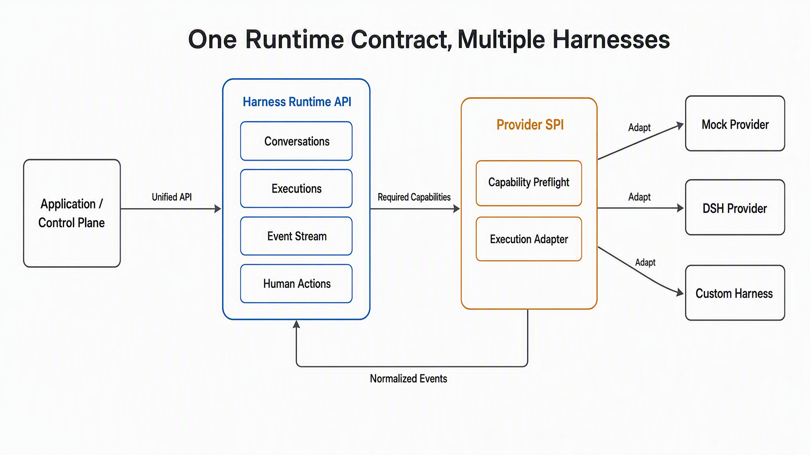
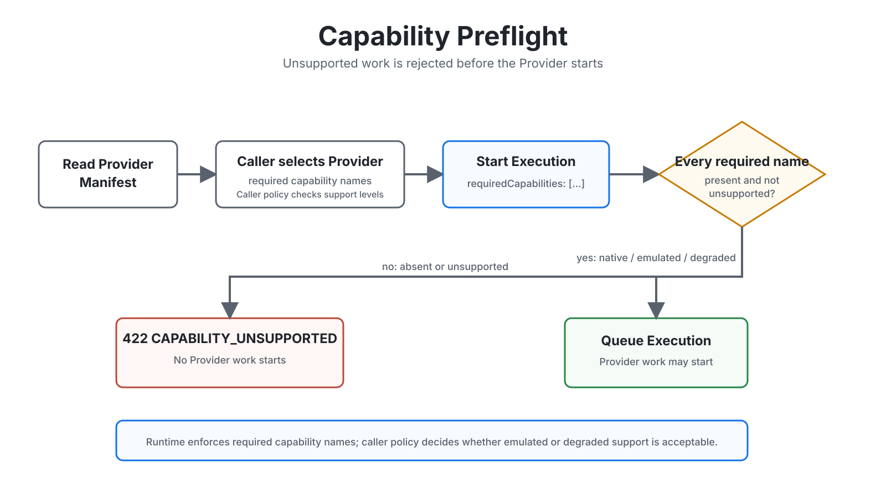
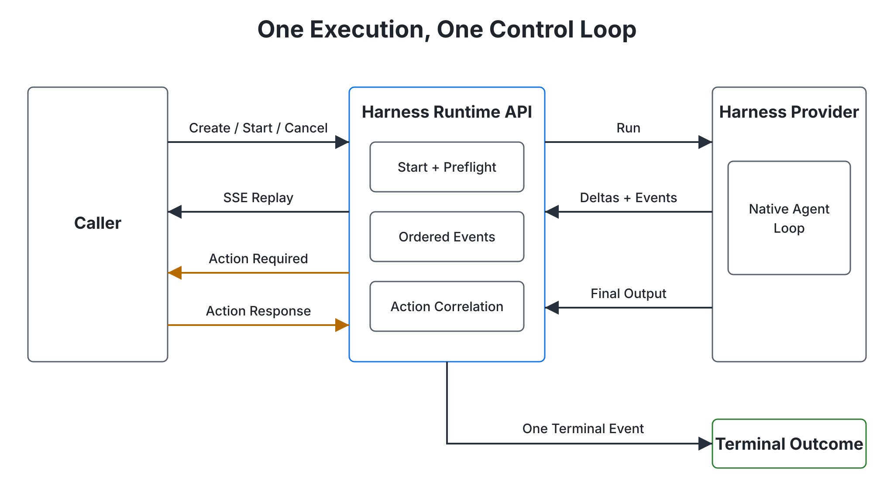
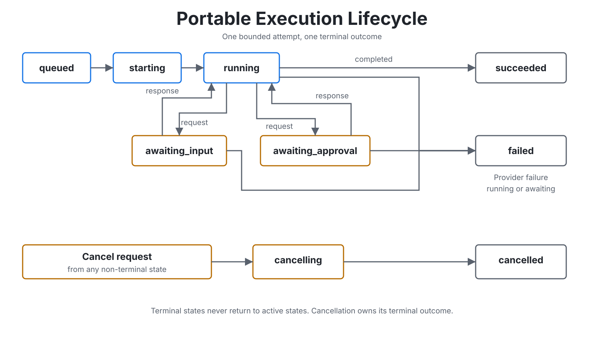
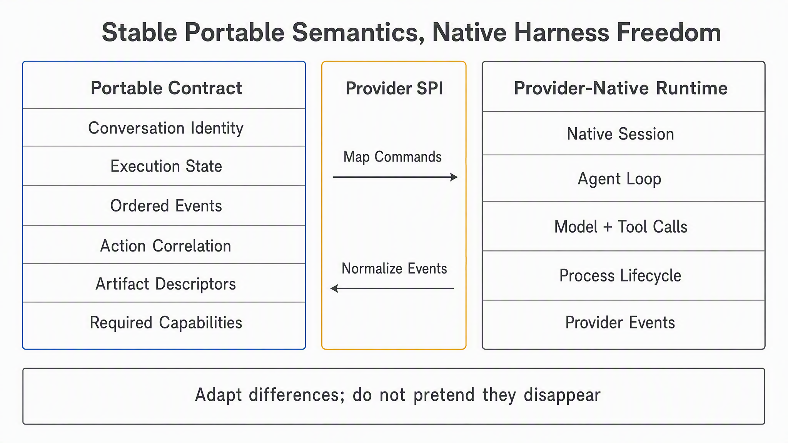
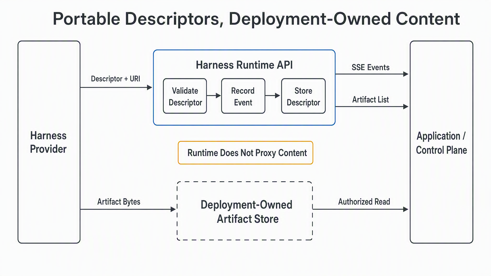
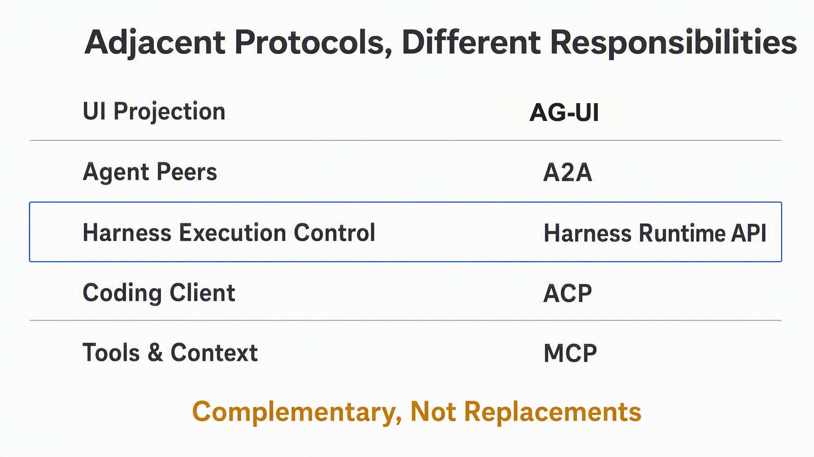
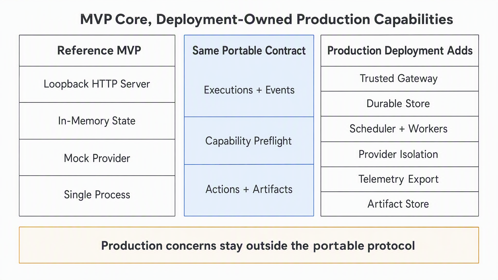

# Harness Runtime API

<p align="center">
  A provider-neutral control and event contract for AI agent harnesses.
</p>

<p align="center">
  <strong>English</strong> | <a href="README.zh-CN.md">简体中文</a>
</p>

> **Experimental:** runtime `0.1.0`, protocol `2026-09-02`. The reference implementation is
> in-memory, unauthenticated, and intended for development or one-process embedding.



Harness Runtime API standardizes how an application starts, observes, and controls bounded agent
executions without forcing every harness to expose the same native SDK. A provider adapter preserves
framework-specific behavior while the portable layer owns lifecycle state, event ordering,
capability negotiation, actions, cancellation, and Artifact descriptors.

It is not another general-purpose agent and does not standardize prompts, model behavior, tool
implementations, native checkpoints, or sandbox internals.

## Why This Exists

Agent harnesses repeatedly expose the same integration concepts through incompatible contracts:
sessions, streaming output, approval, cancellation, artifacts, and process lifecycle. Coupling an
application directly to one harness makes provider changes expensive and hides semantic differences
until runtime.

Harness Runtime API introduces three explicit boundaries:

| Boundary | Responsibility |
| --- | --- |
| Portable protocol | Conversations, executions, events, actions, artifacts, and stable errors |
| Provider SPI | Native SDK/process adaptation and honest capability declarations |
| Deployment | Identity, authorization, persistence, isolation, scheduling, storage, and telemetry |

## Current Surface

| Capability | Status | Notes |
| --- | --- | --- |
| Conversations and bounded executions | Available | One portable conversation can own multiple executions |
| Execution idempotency | Available | Conflicting reuse returns `IDEMPOTENCY_CONFLICT` |
| Event replay and SSE streaming | Available | Monotonic per-execution cursor, at-least-once reconnect semantics |
| Capability preflight | Available | `native`, `emulated`, `degraded`, or `unsupported` |
| Human approval and input | Available | Provider execution pauses on a correlated action request |
| Cancellation | Available | Portable cancellation with provider-specific cleanup |
| Artifact descriptors | Available | Validated creation events and list API; bytes stay outside Runtime |
| Mock Provider | Available | Deterministic development and conformance provider |
| DSH Provider | Experimental | Optional subprocess adapter for the pinned public SDK range |
| Durable persistence and recovery | Not included | Current reference state is process-local |
| Authentication and multi-tenancy | Not included | Must be supplied by a trusted deployment boundary |

## Capability Preflight



The caller can inspect manifests before submitting an execution. Runtime then checks every name in
`requiredCapabilities`: `native`, `emulated`, and `degraded` pass; an absent or `unsupported` name
returns `422 CAPABILITY_UNSUPPORTED` before Provider work starts. Whether degraded support is
acceptable remains caller policy.

## Quick Start

Requirements: Node.js 22 or later and pnpm 10.

```bash
pnpm install
pnpm check
pnpm dev
```

The reference server listens on `127.0.0.1:4310` and registers the Mock Provider.

```bash
conversation_id=$(curl -s -X POST http://127.0.0.1:4310/v1/conversations \
  -H 'content-type: application/json' \
  -d '{"metadata":{"source":"readme"}}' | node -pe \
  'JSON.parse(require("fs").readFileSync(0, "utf8")).id')

execution_id=$(curl -s -X POST http://127.0.0.1:4310/v1/executions \
  -H 'content-type: application/json' \
  -d "{\"conversationId\":\"$conversation_id\",\"providerId\":\"mock\",\"input\":\"hello runtime\",\"idempotencyKey\":\"readme-1\"}" | node -pe \
  'JSON.parse(require("fs").readFileSync(0, "utf8")).id')

curl -N -H 'accept: text/event-stream' \
  "http://127.0.0.1:4310/v1/executions/$execution_id/events?after=0"
```

See the [complete quickstart](docs/tutorials/quickstart.md) for approval, cancellation, replay, and
Artifact examples.

## Execution Control Loop



Commands enter through Runtime; Provider-native work never bypasses the portable event and Action
boundary. SSE replay, human responses, final output, and cancellation all stay correlated to one
Execution. See the [control-loop explanation](docs/explanations/execution-control-loop.md).

## Portable Model

- **Conversation:** caller-facing multi-turn identity.
- **Execution:** one bounded attempt with explicit state and terminal outcome.
- **Event:** append-only observation with a sequence cursor.
- **Action:** correlated approval or input request that pauses provider progress.
- **Artifact:** validated portable descriptor for deployment-owned content.
- **Provider Manifest:** topology and capability support declared before execution.



The normative state machine and invariants live in the [runtime model](spec/runtime-model.md), not in
generated diagrams.

## Portable and Provider-Native Boundary



The portable layer stabilizes lifecycle integration, not model behavior. Native sessions, agent
loops, model/tool calls, process lifecycle, and opaque provider observations remain behind the
Provider SPI. See the [provider-boundary explanation](docs/explanations/provider-boundary.md).

## Artifact Boundary



Providers emit `artifact.created` with `id`, `name`, `mediaType`, optional `uri`, and metadata. The
Runtime validates the descriptor, assigns `executionId` and `createdAt`, records the event, and makes
the descriptor available through:

```http
GET /v1/executions/{executionId}/artifacts
```

The Runtime does not upload, download, proxy, sign, or retain Artifact bytes. URI authorization,
content integrity, scanning, and retention remain deployment responsibilities. See the
[Artifact guide](docs/guides/artifacts.md).

## Protocol Boundaries

Harness Runtime API complements existing agent protocols rather than replacing them:



| Layer | Typical protocol | Primary concern |
| --- | --- | --- |
| User interface | AG-UI or application-specific events | Project agent state into a UI |
| Agent peers | A2A | Communication between independent agents |
| Control plane | **Harness Runtime API** | Start, observe, and control harness executions |
| Coding client | ACP | Connect coding-agent clients and agents |
| Tools and context | MCP | Connect a harness to tools, data, and context |

An adapter may use ACP or a framework SDK internally. The portable runtime additionally defines
idempotency, capability preflight, cursor replay, terminal-state semantics, and action correlation.

## Packages

| Package | Purpose |
| --- | --- |
| `@harness-runtime/protocol` | Zod schemas, TypeScript types, events, and capability vocabulary |
| `@harness-runtime/core` | Provider SPI and in-memory reference runtime |
| `@harness-runtime/provider-mock` | Deterministic provider for development and tests |
| `@harness-runtime/provider-dsh` | Optional DeepSeek Harness subprocess adapter |
| `@harness-runtime/server` | HTTP/JSON and SSE reference binding |
| `@harness-runtime/sdk-typescript` | Validating TypeScript HTTP/SSE client |
| `@harness-runtime/conformance` | Reusable provider lifecycle checks |

Package names are workspace identifiers during the MVP and are not yet published to a registry.

## Documentation

- [Documentation map](docs/README.md)
- [OpenAPI 3.1](spec/openapi.yaml)
- [Protocol semantics](spec/protocol.md)
- [Runtime model and invariants](spec/runtime-model.md)
- [Protocol stack explanation](docs/explanations/protocol-stack.md)
- [Execution lifecycle](docs/explanations/execution-lifecycle.md)
- [Capability preflight](docs/explanations/capability-preflight.md)
- [Execution control loop](docs/explanations/execution-control-loop.md)
- [Portable and provider-native boundary](docs/explanations/provider-boundary.md)
- [Artifact descriptors](docs/guides/artifacts.md)
- [DeepSeek Harness adapter](docs/guides/dsh-provider.md)
- [Production deployment boundary](docs/guides/production-deployment.md)
- [Architecture decisions](spec/README.md)
- [Security policy](SECURITY.md)
- [Changelog](CHANGELOG.md)
- [Release process](RELEASING.md)

## Next Design Areas



The reference server proves protocol behavior; it is not a production platform. The
[production deployment guide](docs/guides/production-deployment.md) defines the controls a trusted
deployment must add without coupling them to the portable contract.

- Durable storage SPI and restart recovery semantics
- Additional provider adapters and capability-specific conformance profiles
- More language SDKs generated from the portable contract
- Deployment examples that add authentication, tenant isolation, and telemetry without moving those
  concerns into the core protocol

These are design directions, not committed release dates.

## Contributing

Read [CONTRIBUTING.md](CONTRIBUTING.md), run `pnpm check` and `pnpm sanitize`, and document any
provider behavior that is emulated, degraded, or unsupported.

## License

Apache License 2.0.
