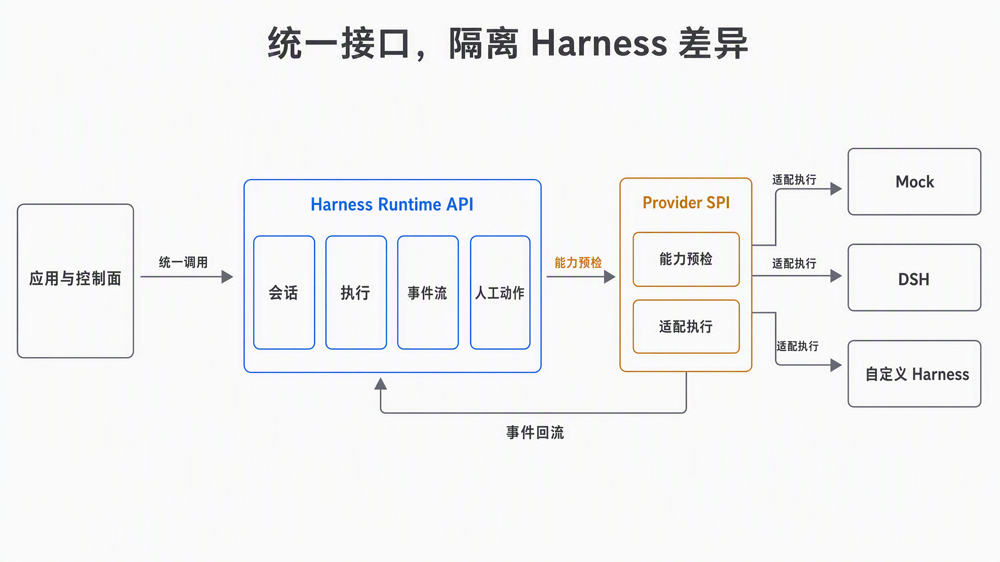
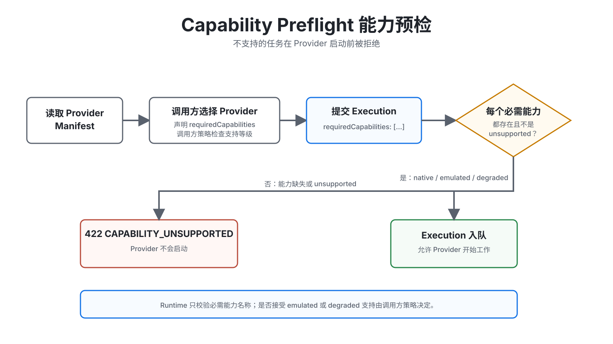
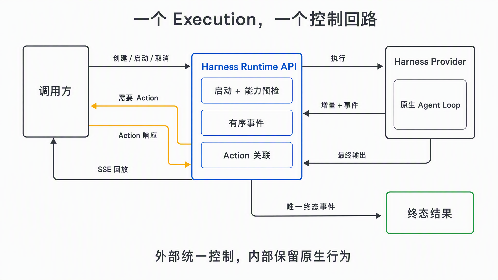
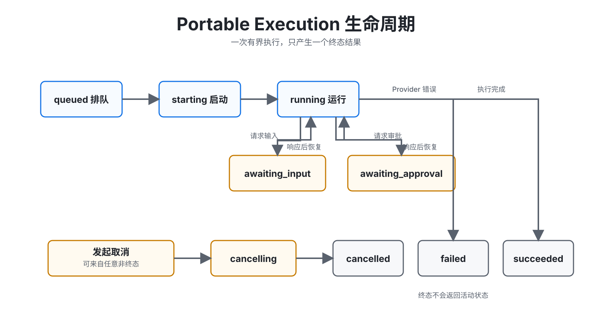
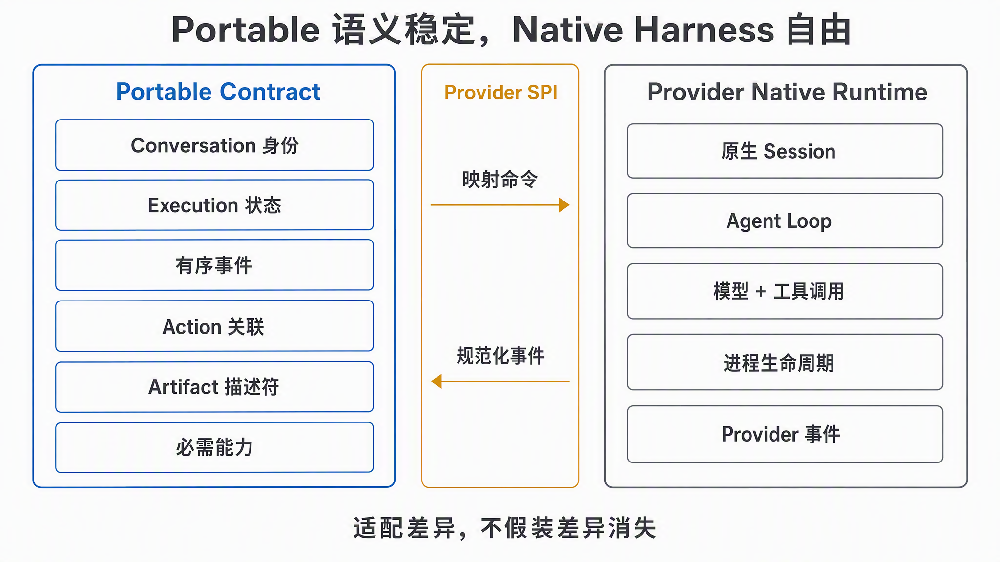
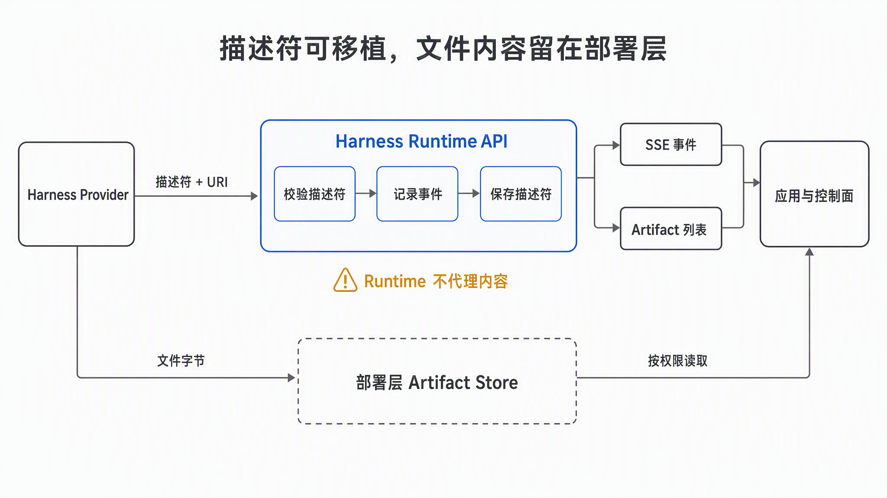
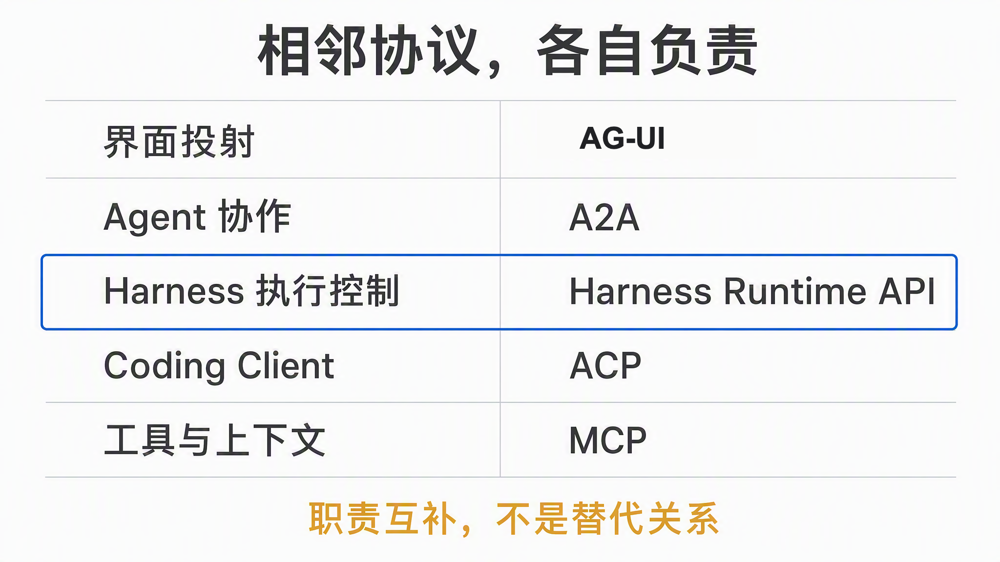
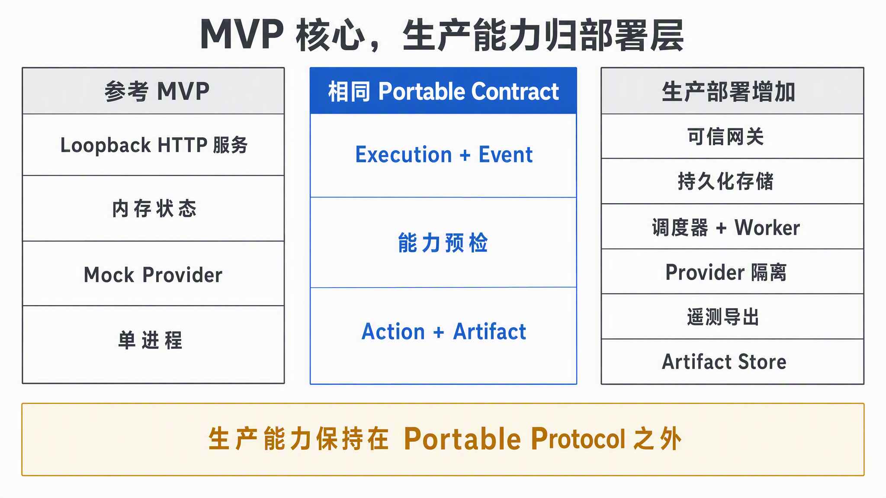

# Harness Runtime API

<p align="center">
  面向 AI Agent Harness 的厂商中立控制与事件契约。
</p>

<p align="center">
  <a href="README.md">English</a> | <strong>简体中文</strong>
</p>

> **实验阶段：** Runtime `0.2.0`，协议 `2026-09-02`。当前参考实现使用内存状态、没有身份认证，
> 适合本地开发、测试或单进程嵌入，不是可直接暴露到公网的多租户平台。



Harness Runtime API 统一应用启动、观察和控制有界 Agent 执行的方式，同时不要求不同 Harness
提供相同的原生 SDK。Provider Adapter 保留框架特性，Portable Runtime 负责生命周期状态、事件
顺序、能力协商、人工动作、取消和 Artifact 描述符。

它不是另一个通用 Agent，也不标准化 Prompt、模型行为、工具实现、原生 Checkpoint 或沙箱内部
机制。

## 为什么需要它

不同 Agent Harness 不断重复提供会话、流式输出、审批、取消、产物和进程生命周期，但接口和语义
并不一致。应用直接绑定某一个 Harness，会提高后续替换成本，并把能力差异推迟到运行时才暴露。

Harness Runtime API 建立三个明确边界：

| 边界 | 职责 |
| --- | --- |
| Portable Protocol | Conversation、Execution、Event、Action、Artifact 和稳定错误模型 |
| Provider SPI | 适配原生 SDK/进程，并诚实声明能力支持等级 |
| Deployment | 身份、权限、持久化、隔离、调度、内容存储和遥测 |

## 当前能力

| 能力 | 状态 | 说明 |
| --- | --- | --- |
| Conversation 与有界 Execution | 已提供 | 一个 Portable Conversation 可包含多次执行 |
| 执行幂等 | 已提供 | 冲突复用返回 `IDEMPOTENCY_CONFLICT` |
| 事件回放与 SSE | 已提供 | Execution 内单调游标，重连采用至少一次语义 |
| 能力预检 | 已提供 | `native`、`emulated`、`degraded`、`unsupported` |
| 人工审批与输入 | 已提供 | Provider 可暂停并等待相关 Action 响应 |
| 执行取消 | 已提供 | Portable 取消语义加 Provider 特定清理 |
| Artifact 描述符 | 已提供 | 创建事件与列表 API；文件内容不进入 Runtime |
| Mock Provider | 已提供 | 确定性的开发和一致性测试 Provider |
| DSH Provider | 实验性 | SDK `0.1.0-rc.7`；原生扩展需由可信部署显式声明 |
| ACP v1 Provider | 实验性 | SDK `1.7.0`；权限请求、文本更新和有界子进程取消 |
| 持久化与重启恢复 | 未提供 | 当前参考状态只存在于进程内 |
| 身份认证与多租户 | 未提供 | 必须由可信部署边界提供 |

## Capability Preflight 能力预检



调用方可以在提交执行前检查 Manifest。Runtime 随后校验 `requiredCapabilities` 中的每个名称：
`native`、`emulated` 和 `degraded` 可以通过；能力缺失或 `unsupported` 会在 Provider 启动前
返回 `422 CAPABILITY_UNSUPPORTED`。是否接受降级支持仍由调用方策略决定。

## 快速开始

环境要求：Node.js 22 或更高版本，pnpm 10。

```bash
pnpm install
pnpm check
pnpm dev
```

参考服务默认监听 `127.0.0.1:4310`，并注册 Mock Provider。

```bash
conversation_id=$(curl -s -X POST http://127.0.0.1:4310/v1/conversations \
  -H 'content-type: application/json' \
  -d '{"metadata":{"source":"readme"}}' | node -pe \
  'JSON.parse(require("fs").readFileSync(0, "utf8")).id')

execution_id=$(curl -s -X POST http://127.0.0.1:4310/v1/executions \
  -H 'content-type: application/json' \
  -d "{\"conversationId\":\"$conversation_id\",\"providerId\":\"mock\",\"input\":\"hello runtime\",\"idempotencyKey\":\"readme-1\"}" | node -pe \
  'JSON.parse(require("fs").readFileSync(0, "utf8")).id')

curl -N -H 'accept: text/event-stream' \
  "http://127.0.0.1:4310/v1/executions/$execution_id/events?after=0"
```

审批、取消、事件回放和 Artifact 示例参见[完整快速入门](docs/tutorials/quickstart.md)。

[可运行示例](examples/README.md)包含应用接入和嵌入式 Provider。`pnpm check` 还会使用实际 DSH SDK
连接合成本地子进程，验证协议、取消和环境隔离，不需要模型凭据。

## Execution 控制回路



命令统一进入 Runtime；Provider Native 工作不会绕过 Portable Event 与 Action 边界。SSE 回放、
人工响应、最终输出和取消始终关联同一个 Execution。详见[控制回路说明](docs/explanations/execution-control-loop.md)。

## Portable 模型

- **Conversation：** 面向调用方的多轮身份。
- **Execution：** 一次有界尝试，拥有显式状态和终态结果。
- **Event：** 带顺序游标的追加式观察记录。
- **Action：** 暂停 Provider 进度的相关审批或输入请求。
- **Artifact：** 指向部署层内容的已校验 Portable 描述符。
- **Provider Manifest：** 在执行开始前声明拓扑和能力支持等级。



规范状态机和不变量以[运行时模型](spec/runtime-model.md)为准，而不是以生成图片为事实源。

## Portable 与 Provider Native 边界



Portable 层稳定的是生命周期集成，而不是模型行为。原生 Session、Agent Loop、模型/工具调用、
进程生命周期和不透明 Provider 观察结果仍保留在 Provider SPI 后面。详见
[Provider 边界说明](docs/explanations/provider-boundary.md)。

## Artifact 边界



Provider 通过 `artifact.created` 提交 `id`、`name`、`mediaType`、可选 `uri` 和 metadata。
Runtime 校验描述符、补齐 `executionId` 与 `createdAt`、记录事件，并通过以下接口提供列表：

```http
GET /v1/executions/{executionId}/artifacts
```

Runtime 不上传、下载、代理、签名或保留 Artifact 文件字节。URI 授权、内容完整性、扫描和保留策略
都属于部署层职责。详见 [Artifact 指南](docs/guides/artifacts.md)。

## 与其他协议的边界

Harness Runtime API 补充现有 Agent 协议，而不是替代它们：



| 层次 | 常见协议 | 主要职责 |
| --- | --- | --- |
| 用户界面 | AG-UI 或应用自定义事件 | 将 Agent 状态投射到 UI |
| Agent 协作 | A2A | 独立 Agent 之间的通信 |
| 控制面 | **Harness Runtime API** | 启动、观察和控制 Harness 执行 |
| Coding Client | ACP | 连接 Coding Agent 客户端与 Agent |
| 工具与上下文 | MCP | 连接 Harness 与工具、数据和上下文 |

Adapter 内部可以使用 ACP 或框架 SDK。Portable Runtime 额外定义幂等、能力预检、游标回放、
终态语义和 Action 关联。

## 项目结构

| Package | 作用 |
| --- | --- |
| `@harness-runtime/protocol` | Zod Schema、TypeScript 类型、事件和能力词汇表 |
| `@harness-runtime/core` | Provider SPI 与内存参考 Runtime |
| `@harness-runtime/provider-mock` | 用于开发和测试的确定性 Provider |
| `@harness-runtime/provider-dsh` | 可选的 DeepSeek Harness 子进程适配器 |
| `@harness-runtime/provider-acp` | ACP v1 子进程适配器，显式映射人工权限选择 |
| `@harness-runtime/server` | HTTP/JSON 与 SSE 参考绑定 |
| `@harness-runtime/sdk-typescript` | 带响应校验的 TypeScript HTTP/SSE Client |
| `@harness-runtime/conformance` | 可复用的 Provider 生命周期一致性检查 |

MVP 阶段这些名称只作为 workspace 标识，尚未发布到包注册中心。

## 文档导航

- [文档地图](docs/README.md)
- [OpenAPI 3.1](spec/openapi.yaml)
- [协议语义](spec/protocol.md)
- [运行时模型与不变量](spec/runtime-model.md)
- [协议栈边界](docs/explanations/protocol-stack.md)
- [Execution 生命周期](docs/explanations/execution-lifecycle.md)
- [Capability Preflight](docs/explanations/capability-preflight.md)
- [Execution 控制回路](docs/explanations/execution-control-loop.md)
- [Portable 与 Provider Native 边界](docs/explanations/provider-boundary.md)
- [Artifact 描述符](docs/guides/artifacts.md)
- [DeepSeek Harness Adapter](docs/guides/dsh-provider.md)
- [ACP v1 Adapter](docs/guides/acp-provider.md)
- [生产部署边界](docs/guides/production-deployment.md)
- [架构决策](spec/README.md)
- [安全策略](SECURITY.md)
- [变更记录](CHANGELOG.md)
- [发布流程](RELEASING.md)

## 下一步设计方向



参考服务用于证明协议行为，不是生产平台。[生产部署指南](docs/guides/production-deployment.md)列出
可信部署必须增加的控制，同时避免把这些能力耦合进 Portable Contract。

- Durable Storage SPI 与重启恢复语义
- 更多 Provider Adapter 和按能力划分的一致性测试 Profile
- 基于 Portable Contract 的更多语言 SDK
- 在不污染核心协议的前提下，提供身份认证、租户隔离和遥测部署示例

这些是设计方向，不代表已经承诺发布日期。

## 参与贡献

阅读 [CONTRIBUTING.md](CONTRIBUTING.md)，运行 `pnpm check` 与 `pnpm sanitize`，并明确记录
Provider 中任何 `emulated`、`degraded` 或 `unsupported` 行为。

## 许可证

Apache License 2.0。
